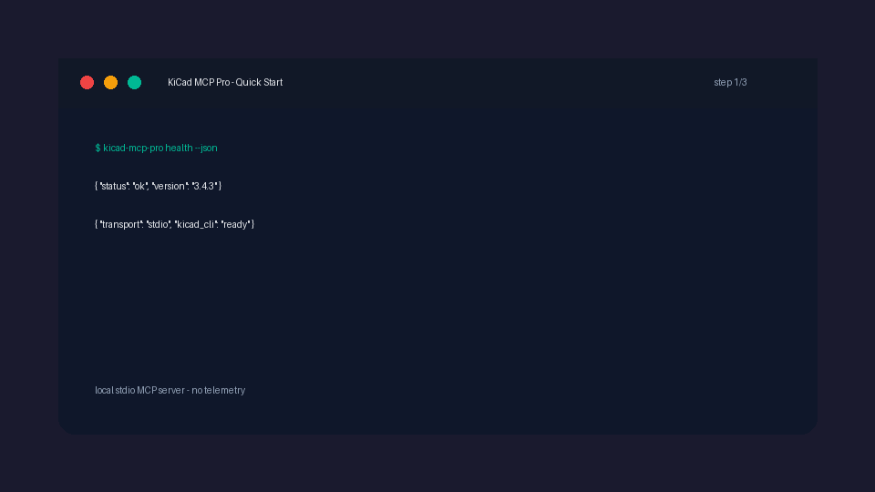

# KiCad MCP Pro Server

<!-- mcp-name: io.github.oaslananka/kicad-mcp-pro -->

[](https://pypi.org/project/kicad-mcp-pro/)
[](https://github.com/oaslananka/kicad-mcp-pro/actions/workflows/ci.yml)
[](https://github.com/oaslananka/kicad-mcp-pro/actions/workflows/docs.yml)
[](https://github.com/oaslananka/kicad-mcp-pro/actions/workflows/release-please.yml)
[](https://codecov.io/gh/oaslananka/kicad-mcp-pro)
[](https://github.com/oaslananka/kicad-mcp-pro/actions/workflows/scorecard.yml)
[](LICENSE)
[](pyproject.toml)
[](https://www.kicad.org)
[](https://buymeacoffee.com/oaslananka)



KiCad MCP Pro is a Model Context Protocol server for KiCad PCB and schematic workflows. It gives agents project setup, schematic editing, PCB inspection and edits, validation gates, DFM checks, SI/PI helpers, simulation helpers, and release-gated manufacturing export.

Use it with Claude Desktop, Claude Code, Cursor, VS Code, Codex, or any MCP-compatible client.

Canonical repository: https://github.com/oaslananka/kicad-mcp-pro

Container migration: the previous GHCR namespace is retired. Use
`ghcr.io/oaslananka/kicad-mcp-pro` for all Docker installs and MCP client
configurations.

## Quick Start

Install and run with `uvx`:

```bash
uvx kicad-mcp-pro --help
uvx kicad-mcp-pro health --json
uvx kicad-mcp-pro doctor --json
uvx kicad-mcp-pro serve
```

Or install with `pip`:

```bash
pip install kicad-mcp-pro
kicad-mcp-pro --help
kicad-mcp-pro health --json
kicad-mcp-pro serve
```

The default no-subcommand invocation still starts the stdio MCP server for
backward compatibility. `health --json` is safe to run when KiCad is not
running; it reports KiCad IPC as deferred instead of crashing. `doctor --json`
adds deeper CLI and IPC diagnostics for launchers such as `kicad-studio`.

## Minimal MCP Config

Use an absolute KiCad project path:

```json
{
  "servers": {
    "kicad": {
      "type": "stdio",
      "command": "uvx",
      "args": ["kicad-mcp-pro"],
      "env": {
        "KICAD_MCP_PROJECT_DIR": "/absolute/path/to/your/kicad-project",
        "KICAD_MCP_WORKSPACE_ROOT": "/absolute/path/to/your/workspace",
        "KICAD_MCP_PROFILE": "pcb_only"
      }
    }
  }
}
```

More client examples:

- [Client configuration](docs/client-configuration.md)
- [Claude Desktop](docs/integration/claude-desktop.md)
- [Cursor](docs/integration/cursor.md)
- [Claude Code](docs/integration/claude-code.md)
- [KiCad Studio](docs/integration/kicad-studio.md)

## What It Does

- Project-aware setup with safe path handling and recent-project discovery.
- PCB tools for board state, tracks, vias, footprints, layers, zones, placement, and sync.
- Schematic tools for symbols, wires, labels, buses, annotation, templates, routing, and IPC reload.
- Validation gates for schematic quality, connectivity, PCB quality, placement, transfer, DFM, and manufacturing.
- Gated release handoff through `export_manufacturing_package()`.
- Export tools for Gerber, drill, BOM, PDF, netlist, STEP, render, pick-and-place, IPC-2581, ODB++, SVG, and DXF.
- SI, PI, EMC, routing, simulation, library, and version-control helper surfaces.
- Server profiles such as `minimal`, `pcb_only`, `schematic_only`, `manufacturing`, `analysis`, and `agent_full`.
- Machine-readable CLI diagnostics for editors and MCP clients.

## Capability Status

Capabilities are verified at different levels depending on test coverage and runtime dependencies.
See [Capability Verification Levels](docs/status/capability-levels.md) for the current truth table.

## Common Workflow

```text
kicad_set_project()
project_get_design_spec()
sch_build_circuit()
pcb_sync_from_schematic()
project_quality_gate_report()
export_manufacturing_package()
```

Demo media guidance lives in [docs/demo-media.md](docs/demo-media.md).

## Documentation

- [Installation](docs/installation.md)
- [Configuration](docs/configuration.md)
- [Tools reference](docs/tools-reference.md)
- [Troubleshooting](docs/troubleshooting.md)
- [FAQ](docs/faq.md)
- [API stability](docs/api-stability.md)
- [Release process](docs/release-process.md)
- [Maintenance policy](docs/maintenance-policy.md)
- [Workflow security](docs/workflow-security.md)
- [Publishing](docs/publishing.md)
- [Privacy policy](https://oaslananka.github.io/kicad-mcp-pro/privacy/)
- [Public listings](PUBLIC_LISTING.md)
- [Release integrity](docs/security/release-integrity.md)
- [Docker install](docs/install/docker.md)
- [Client config generator](docs/install/client-config-generator.md)
- [Security threat model](docs/security/threat-model.md)
- [Architecture decisions](docs/adr/README.md)
- [Comparison](docs/comparison.md)

## Repository Operations

Normal CI and security workflows run on pull requests, pushes, and merge queue
events. Release, publish, deployment, and token-backed jobs remain
guarded behind explicit repository checks and protected environments.

The project uses Dependabot, Renovate, CodeQL, Gitleaks, Trivy, OpenSSF
Scorecard, Codecov, release-please, SBOM generation, Sigstore signing, and
GitHub artifact attestations for release hardening.

Operational references:

- [Repository operations](docs/repository-operations.md)
- [Publishing](docs/publishing.md)
- [Autonomy model](docs/autonomy.md)
- [Doppler setup](docs/doppler-setup.md)
- [Branch protection](docs/branch-protection.md)

## Contributing and Support

- [Contributing](CONTRIBUTING.md)
- [Support](SUPPORT.md)
- [Governance](GOVERNANCE.md)
- [Security policy](SECURITY.md)
- [Roadmap](ROADMAP.md)
- [Changelog](CHANGELOG.md)
